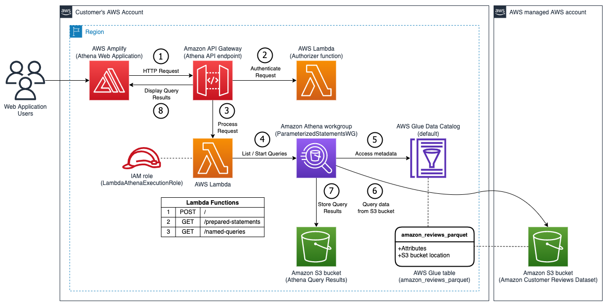
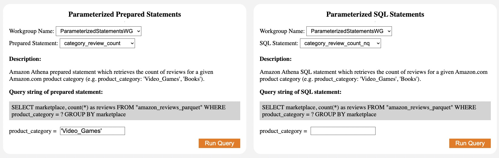
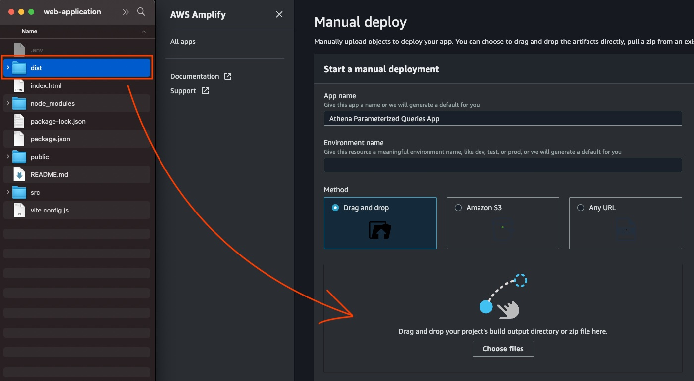
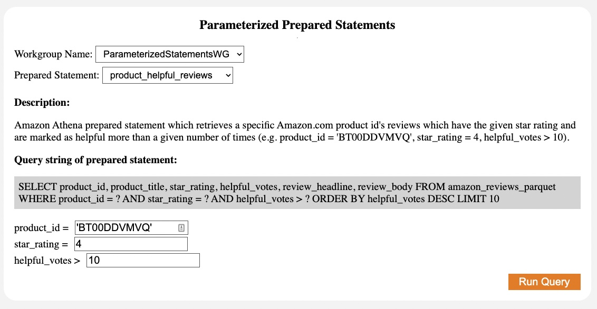

## Athena Parameterized Queries Blog

This is a repository for [Use Amazon Athena parameterized queries to provide data as a service](https://aws.amazon.com/blogs/big-data/use-amazon-athena-parameterized-queries-to-provide-data-as-a-service/) blog post. It contains a CloudFormation template for provisioning accompanying resources and assets for deploying a sample web application to demonstrate new ability to pass executions parameters to Amazon Athena [StartQueryExecution API](https://docs.aws.amazon.com/athena/latest/APIReference/API_StartQueryExecution.html).

### Prerequisites:

This sample application uses the following AWS services to demonstrate a Data-as-a-Service (DaaS) architecture pattern that uses Amazon Athena to query the Amazon.com customer reviews dataset.

- [AWS Amplify](https://docs.aws.amazon.com/amplify/latest/userguide/welcome.html)
- [Amazon API Gateway](https://docs.aws.amazon.com/apigateway/latest/developerguide/welcome.html)
- [Amazon Athena](https://docs.aws.amazon.com/athena/latest/ug/what-is.html)
- [AWS CloudFormation](https://docs.aws.amazon.com/AWSCloudFormation/latest/UserGuide/Welcome.html)
- [Amazon DynamoDB](https://docs.aws.amazon.com/amazondynamodb/latest/developerguide/Introduction.html)
- [AWS Glue](https://aws.amazon.com/glue) and AWS Glue Data Catalog
- [AWS Identity and Access Management](https://docs.aws.amazon.com/IAM/latest/UserGuide/introduction.html) (IAM)
- [AWS Lambda](https://docs.aws.amazon.com/lambda/latest/dg/welcome.html)
- [Amazon S3](https://docs.aws.amazon.com/AmazonS3/latest/userguide/Welcome.html)

The instructions assume you have:

- An AWS Account. For instructions, refer to [Creating an AWS account](https://docs.aws.amazon.com/accounts/latest/reference/manage-acct-creating.html).
- A CloudTrail trail created. For instructions, refer to [Creating a trail](https://docs.aws.amazon.com/awscloudtrail/latest/userguide/cloudtrail-create-a-trail-using-the-console-first-time.html).
- Amazon S3 Bucket created. For instructions, refer to [Creating a bucket](https://docs.aws.amazon.com/AmazonS3/latest/userguide/create-bucket-overview.html).
- [Node.js](https://nodejs.org/) version 16+ installed on your device.

### Deploy the CloudFormation Stack

In this section, you deploy a CloudFormation template ([athena-parameterized-queries.yaml](athena-parameterized-queries.yaml)) that creates the following resources:

- AWS Glue Data Catalog database
- AWS Glue Data Catalog table
- Amazon Athena workgroup
- Three Athena prepared statements
- Three Athena named queries
- The API Gateway HTTP API
- The Lambda execution role for Athena queries
- The Lambda execution role for API Gateway HTTP API authorization
- Five Lambda functions:
  - Update the AWS Glue Data Catalog
  - Authorize API Gateway requests
  - Submit Athena queries
  - List Athena prepared statements
  - List Athena named queries





To deploy the CloudFormation stack template, follow these steps:

1. Navigate to this [GitHub repository](https://github.com/aws-samples/amazon-athena-execution-parameters-blog).
2. Clone the repository or copy the CloudFormation template `athena-parameterized-queries.yaml`.
3. On the [AWS CloudFormation](https://console.aws.amazon.com/cloudformation) console, choose **Create stack**.
4. Select **Upload a template file** and choose **Choose file**.
5. Upload `athena-parameterized-queries.yaml`, then choose **Next**.
6. On the **Specify stack details** page, enter the stack name `athena-parameterized-queries`.
7. On the same page, there are two parameters:
   1. For **S3QueryResultsBucketName**, enter the S3 bucket name in your AWS Account and in the same AWS Region as where you're running your CloudFormation stack. (For this post, we use the bucket name value, like `my-bucket`).
   2. For **APIPassphrase**, enter a passphrase to authenticate API requests. You use this later.
8. Choose **Next**.
9. On the **Configure stack options** page, choose **Next**.
10. On the **Review** page, choose **I acknowledge that AWS CloudFormation might create IAM resources with custom names**, and choose **Create stack**.

The script takes less than two minutes to run and change to a `CREATE_COMPLETE` state. If you deploy the stack twice in the same AWS account and Region, some resources may already exist, and the process fails with a message indicating the resource already exists in another template.

11. On the **Outputs** tab, copy the `APIEndpoint` value to use later.

Refer to [Use Amazon Athena parameterized queries to provide data as a service](https://aws.amazon.com/blogs/big-data/use-amazon-athena-parameterized-queries-to-provide-data-as-a-service/) blog for guidance on least-privilege authorization for deployment of the CloudFormation template.

### Deploy the Amplify application

In this section, you deploy your Amplify application.

1. In the cloned repository, open `web-application/.env` in a text editor.
2. Set `AWS_API_ENDPOINT` as the `APIEndpoint` value from the CloudFormation stack **Outputs**. For example: `AWS_API_ENDPOINT="https://123456abcd.execute-api.your-region.amazonaws.com"`.
3. Set `API_AUTH_CODE` as the value you input as the CloudFormation stack's `APIPassphrase` parameter argument. For example: `API_AUTH_CODE="YOUR_PASSPHRASE"`.
4. Navigate to the `web-application/` directory and run `npm install`.
5. Run `npm run build` to compile distribution assets.
6. On the [Amplify](https://console.aws.amazon.com/amplify) console, choose **All apps**.
7. Choose **New app**.
8. Select **Host web app**, select **Deploy without Git provider**, then choose **Continue**.
9. For **App name**, enter `Athena Parameterized Queries App`.
10. For **Environment name**, you don't need to enter a value.
11. Select **Drag and Drop**.
12. Locate `dist/` directory inside `web-application/`, drag it into the window and drop it. Ensure you drag the entire directory, not the files within it.



13. Choose **Save and deploy** to deploy the web application on Amplify.

This step will take less than a minute to complete.

14. Under **App settings**, choose **Access control**, then choose **Manage access**
15. Select **Apply a global password**, then enter values for **Username** and **Password**.

You will use these credentials to access your Amplify application.

##### Troubleshooting:

- If the Amplify app page shows as blank, refer back to Step 10 and make sure to drag and drop the entire **dist/** directory instead of individual files inside of it
- If you see **Network Error**, verify that **web-application/.env** file has the correct API Endpoint URL (refer back to Step 12 in **Instruction to deploy the API**)
- If you see error **status code 403**, verify that **web-application/.env** file has the correct Passphrase (refer back to Step 1)

### Access your Amplify application and run queries

In this section, you use the Amplify application to run Athena parameterized queries against the Amazon.com customer reviews dataset. The left side of the application shows how you can run parameterized queries using Athena prepared statements. The right side of the application shows how you can run parameterized queries without prepared statements, such as if the queries are written in your code; this sample uses named queries within the Athena workgroup. For more information about named queries, refer to [NamedQuery](https://docs.aws.amazon.com/athena/latest/APIReference/API_NamedQuery.html) in the [Amazon Athena API Reference](https://docs.aws.amazon.com/athena/latest/APIReference/Welcome.html).

1. Open the Amplify web application link located under **Domain**. For example: `https://dev123.abcd12345xyz.amplifyapp.com/`.
2. In the **Sign in** prompt, enter the user name and password your provided as the Amplify application global password.
3. For **Workgroup Name**, choose `ParameterizedStatementsWG` workgroup.
4. Choose a statement example on the **Prepared Statement** or **SQL Statement** drop-down menu.

Selecting a statement displays a description about the query, including examples of parameters you can try with this statement, and the original SQL query string. SQL parameters of type string must be surrounded by single quotes, for example: `'your_string_value'`.

5. Enter your query parameters.

The following figure depicts an example of the parameters to input for the `product_helpful_reviews` prepared statement.



6. Choose **Run Query** to send the query request to the API endpoint.

After the query runs, the results will be returned as a table. The complete query workflow is depicted in the previous architecture diagram.

#### Using execution parameters with the AWS SDK for Python (Boto3)

In this section, you inspect the Lambda function code for using the `StartQueryExecution` API with and without prepared statements.

1.  On the [Lambda](https://console.aws.amazon.com/lambda) console, choose **Functions**.
2.  Navigate to `LambdaAthenaFunction-athena-parameterized-queries` Lambda function.
3.  Choose the **Code Source** window.

Examples of passing parameters to the Athena `StartQueryExecution` API using AWS SDK for Python (Boto3) begin on lines 39 and 49. Note the new `ExecutionParameters` option on lines 45 and 55.

The following code uses execution parameters with Athena prepared statements:

```
response = athena.start_query_execution(
   QueryString=f'EXECUTE {statement}', # Example: "EXECUTE prepared_statement_name"
   WorkGroup=workgroup,
   QueryExecutionContext={
      'Database': 'athena_prepared_statements'
   },
   ExecutionParameters=input_parameters
)
```

The following code uses execution parameters without Athena prepared statements:

```
response = athena.start_query_execution(
   QueryString=statement, # Example: "SELECT \* FROM TABLE WHERE parameter_name = ?"
   WorkGroup=workgroup,
   QueryExecutionContext={
      'Database': 'athena_prepared_statements'
   },
   ExecutionParameters=input_parameters
)
```

### Clean up

In this post, you created several components, which generate cost. To avoid incurring future charges, remove the resources with the following steps:

1. [Delete the S3 bucket’s results prefix](https://docs.aws.amazon.com/AmazonS3/latest/userguide/using-folders.html#delete-folders) created after you ran a query on your workgroup.

With the default template, the prefix is named `<S3QueryResultsBucketName>/athena-results`. Use caution in this step. Unless you are [using versioning on your S3 bucket](https://docs.aws.amazon.com/AmazonS3/latest/userguide/Versioning.html), deleting S3 objects cannot be undone.

2. On the Amplify console, select the app to delete and on the **Actions** menu, choose **Delete app**, then confirm.
3. On the AWS CloudFormation console, select the stack to delete, choose **Delete**, and confirm.

## Security

See [CONTRIBUTING](CONTRIBUTING.md#security-issue-notifications) for more information.

## License

This project is licensed under the MIT-0 License. See the LICENSE file.
